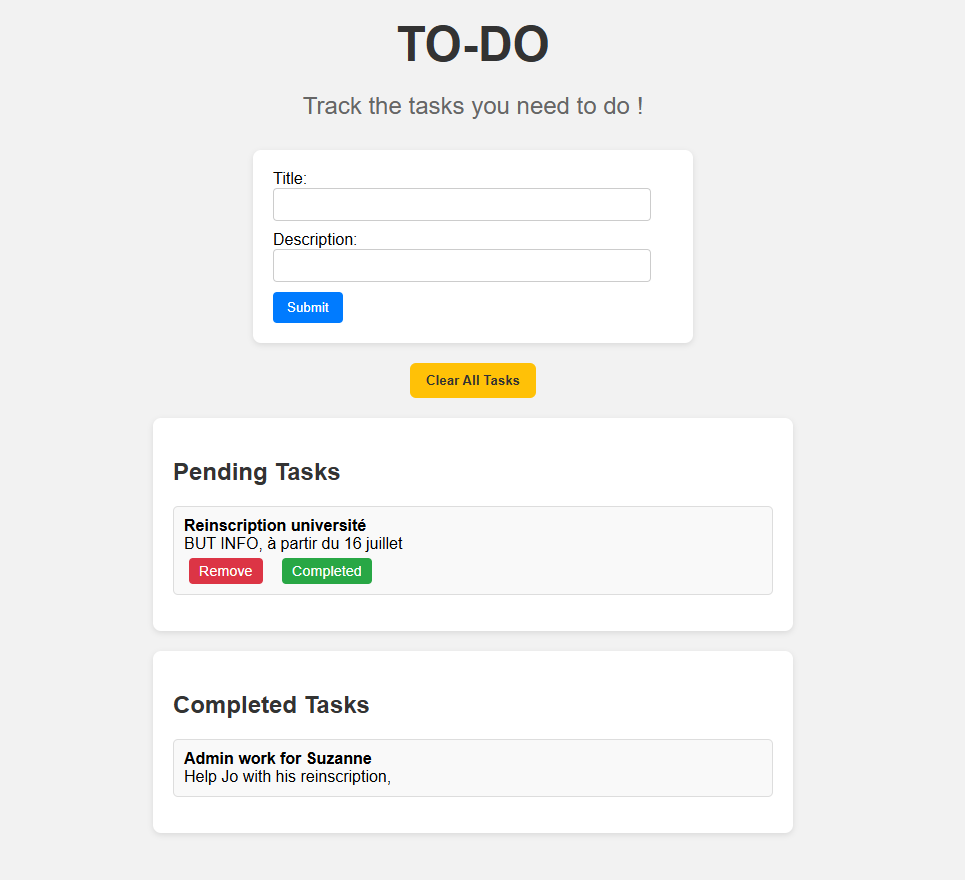

# PHP To-Do List

A simple to-do list web app built with PHP and sessions. Users can add, complete, and remove tasks directly in their browser — no database required.

## Features

- Add tasks with a title and description
- Mark tasks as completed
- Remove individual tasks
- Clear all tasks (pending and completed)
- Tasks persist across page reloads using PHP sessions

## Tech Stack

- PHP (no external libraries)
- HTML/CSS
- Sessions for in-memory task storage
- Styled with basic CSS (customizable)

## How to Run

1. Install [WAMP](https://www.wampserver.com/) or any PHP web server.
2. Place the project folder inside the `www` directory (or equivalent).
3. Start the server and visit `http://localhost/todo_list/form.php` in your browser.

## Screenshot

